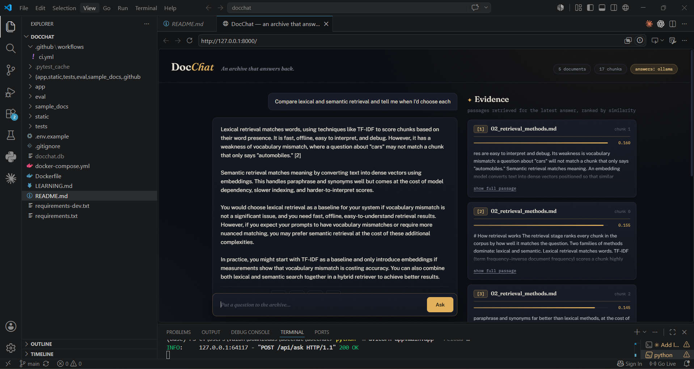

# DocChat — ask questions about your documents, with the evidence shown

A retrieval-augmented generation (RAG) application: upload documents, ask
questions, and get answers grounded in your own text — with every retrieved
passage displayed and scored next to the answer, so claims are checkable
against their sources.

**Stack:** Python · FastAPI · SQLAlchemy (MySQL / SQLite) · scikit-learn ·
Anthropic API / Ollama / Groq · Docker · GitHub Actions



## Why this exists

Most RAG demos hide the retrieval step. DocChat makes it the centrepiece:
the Evidence panel shows exactly which chunks were retrieved, from which
document, at what similarity score — because in a RAG system, retrieval
quality bounds answer quality, and you can't debug what you can't see.

## Architecture

```
                      ┌─────────────── ingestion ───────────────┐
 .txt / .md / .pdf ──►  paragraph-aware chunking (with overlap) ──► MySQL/SQLite
      upload           (PDF text extracted via pypdf)
                      └──────────────────────────────────────────┘      │
                                                                        ▼
 question ──► TF-IDF + cosine ranking ──► top-k chunks ──► LLM (grounded prompt,
              (rebuilt on corpus change)        │           inline [n] citations)
                                                │                 │
                                                ▼                 ▼
                                        Evidence panel      cited answer
```

## LLM providers

Answer generation is pluggable behind an `LLMProvider` interface, selected
with the `LLM_PROVIDER` environment variable. All providers receive the same
grounding system prompt (answer from the provided passages only, cite `[n]`,
admit when the context doesn't contain the answer).

| `LLM_PROVIDER` | backend | needs | notes |
|---|---|---|---|
| `anthropic` (default) | Anthropic API | `ANTHROPIC_API_KEY` | model via `ANTHROPIC_MODEL` (default `claude-sonnet-4-5`) |
| `ollama` | local [Ollama](https://ollama.com) server at `http://localhost:11434` | `ollama serve` + a pulled model | model via `OLLAMA_MODEL` (default `llama3`) — fully offline |
| `groq` | [Groq](https://groq.com) OpenAI-compatible API | `GROQ_API_KEY` | model via `GROQ_MODEL` (default `llama-3.3-70b-versatile`) — fast hosted open models |
| `none` | — | — | retrieval-only: top passages returned verbatim |

If the selected provider is unavailable — missing key, Ollama not running,
API error — DocChat degrades to retrieval-only for that question instead of
erroring, and the header badge shows which provider is active.

## Run it

**Local (SQLite, 30 seconds):**

```bash
pip install -r requirements.txt
uvicorn app.main:app --reload
# open http://localhost:8000  — sample corpus about RAG is pre-loaded
```

**Docker (MySQL):**

```bash
docker compose up --build
# open http://localhost:8000
```

Optional, for generated answers (see the provider table above):

```bash
cp .env.example .env               # then pick a provider

# Anthropic API (default provider)
export ANTHROPIC_API_KEY=sk-ant-...

# or a local model via Ollama
ollama pull llama3
export LLM_PROVIDER=ollama
export OLLAMA_MODEL=llama3         # optional, this is the default
```

## API

| method | path | description |
|---|---|---|
| `GET` | `/api/stats` | corpus size, whether generation is enabled |
| `GET` | `/api/documents` | list documents with chunk counts |
| `POST` | `/api/documents` | upload a `.txt`/`.md`/`.pdf` file (multipart, ≤ 2 MB) — `201`, `400`, `409` on duplicate |
| `DELETE` | `/api/documents/{id}` | remove a document and re-index — `204`, `404` |
| `POST` | `/api/ask` | `{"question": "..."}` → answer + scored sources — `422` on invalid input, `429` over the rate limit |
| `GET` | `/api/history` | recent question/answer exchanges |

Interactive docs at `/docs` (FastAPI's built-in OpenAPI UI).

For public demos, `ASK_RATE_LIMIT` caps questions per IP per hour on
`POST /api/ask` (in-memory, per process; unset means no limit).

## Tests and evaluation

```bash
python -m pytest tests/ -v     # 32 tests: chunking, retrieval, LLM providers (mocked), rate limiting, full API round-trips
python -m eval.run_eval        # retrieval quality over 14 labelled questions
```

Current evaluation results (k=4):

```
hit@4:            13/14  (93%)
MRR:              0.929
keyword recall:   12/14  (86%)
```

**The one failure is kept on purpose.** "Why does chunk size matter?" misses
because the source text says *chunking* and *chunks that are too small* —
never the exact words "chunk size". That is lexical retrieval's documented
weakness (vocabulary mismatch), surfaced by the eval set exactly as an eval
set should. CI runs this evaluation on every push and fails the build if
hit@k drops below 80%.

## Design decisions

- **TF-IDF before embeddings.** The retriever is a baseline chosen
  deliberately: offline, fast, interpretable, zero model downloads. The
  eval set exists so that swapping in an embedding model (the `Retriever`
  class is the single seam) becomes a measured decision, not a fashion
  choice — the recorded vocabulary-mismatch failure is the exact evidence
  that would justify it.
- **Paragraph-aware chunking with overlap.** Paragraphs tend to carry one
  idea; overlap keeps answers that straddle a boundary retrievable. Both
  knobs are environment variables (`CHUNK_SIZE`, `CHUNK_OVERLAP`).
- **Grounding lives in the prompt, verification lives in the UI.** The
  system prompt restricts the model to the provided passages and requires
  citations; the Evidence panel lets a human check them.
- **In-memory index, single worker.** The TF-IDF index lives in process
  memory and is rebuilt whenever the corpus changes. Run uvicorn with one
  worker (the default): with multiple workers, an upload handled by one
  process would not appear in the others' indexes until restart. The
  per-IP rate limiter is in-memory too and shares the same constraint.
  If the LLM API is unreachable at answer time, the app degrades to
  retrieval-only for that question instead of erroring.
- **SQLite by default, MySQL in compose.** Same SQLAlchemy models either
  way; `DATABASE_URL` decides. Local dev and CI stay dependency-free while
  the compose stack exercises a production-shaped database.

## Roadmap

- Hybrid retrieval (TF-IDF + embeddings, merged rankings) once measurements justify it
- Image ingestion via OCR
- Streaming answers over server-sent events
- Per-answer thumbs up/down feeding the eval set

## Licence

MIT
